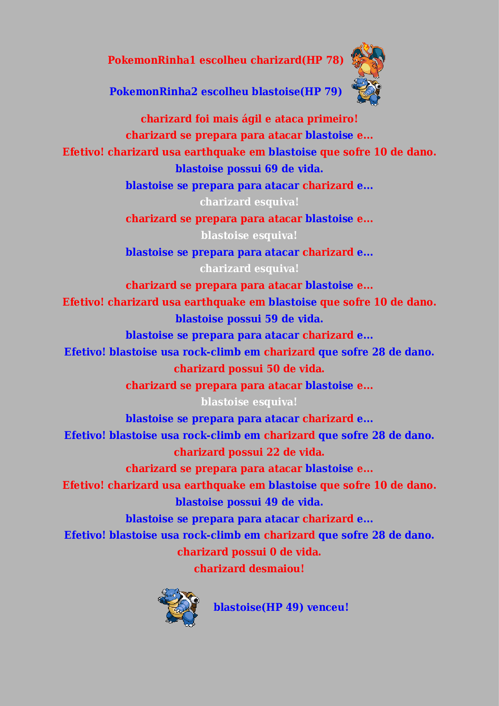

👤 **Matheus S. Gomes**

* Website: https://matheus.sgomes.dev
* Github: [@Matheussg42](https://github.com/Matheussg42)
* LinkedIn: [@matheussg](https://linkedin.com/in/matheussg)
* Bot: [@PokemonRinha](https://twitter.com/PokemonRinha)

---

  
  
  

#### Nesta Página:

* [Tecnologias](#tecnologias)
* [Projeto](#projeto)

## Tecnologias

Esse projeto foi desenvolvido com as seguintes tecnologias:

- [PHP](https://www.php.net/)
- [Laravel](https://laravel.com/)
- [PokéAPI](https://pokeapi.co/)

## Projeto

O Bot é um projeto feito para treinar o conhecimento nas tecnologias citadas a cima. Neste projeto, foi criada uma batalha pokemon que será feita entre dois usuários do Twitter.

Utilizada a [PokéAPI](https://pokeapi.co/) para retornar montar informações do Pokemon e preparar a batalha. Além de usarmos a biblioteca `Spatie\LaravelTwitterStreamingApi` para pegar os tweets em tempo real, e o `Abraham\TwitterOAuth` para pegar tweets, e postar a resposta com o resultado da batalha.

Todos os tweets localizados pelo `Spatie\LaravelTwitterStreamingApi` precisam marcar o bot [@PokemonRinha](https://twitter.com/PokemonRinha), e ser uma respota(Apenas a resposta de um desafio entra no fluxo). Caso o tweet cumpra os requisitos, ele é inserido em uma `Queue`(Fila), para que o sistema faça o processamento de todas as batalhas, não importanto o fluxo de batalhas naquele momento.

Cada batalha passa pelo seguinte fluxo:
- Analisa os tweets e encontra os Pokémons escolhidos.
- Forma as equipes contendo os @'s que estão participando da batalha e então consulta a [PokéAPI](https://pokeapi.co/) para retornar as informações do Pokémon.
    - [Dados do Pokémon - https://pokeapi.co/api/v2/pokemon/charmander](https://pokeapi.co/api/v2/pokemon/charmander)
    - [Tipo do Pokémon - https://pokeapi.co/api/v2/type/10](https://pokeapi.co/api/v2/type/10)
    - [Ataques do Pokémon(Pegamos dois ataques randomicamente) - https://pokeapi.co/api/v2/move/53](https://pokeapi.co/api/v2/move/53)
    - [Cor referente ao tipo. Ex: Fogo => Vermelho - https://pokeapi.co/api/v2/pokemon-species/4](https://pokeapi.co/api/v2/pokemon-species/4/)
- Aplica bônus nos ataques baseado nos tipos dos Pokémons.
- Define quem começa baseado na Stat de velocidade.
- Faz a batalha
    - A batalha funciona por turnos. A cada turno, há a oportunidade dos dois Pokémons atacarem.
    - Na batalha, os Pokémons podem se esquivar de um ataque baseado na Stat de velocidade.
    - Após um ataque(Randômico), o número referente ao dano do ataque é subtraído do HP do adversário.
    - Quando o HP de um dos dois Pokémon chegar a ZERO, a batalha termina, e é declarado um vencedor.
- Gera uma imagem com a batalha que é postada na resposta do Tweet.

